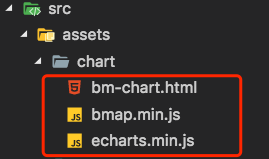

Eros 扩展的 Components

## 图表组件
> 基于 echart 实现的图标组件，支持 echart 的所有图表类型；

### 效果展示


### 属性：

* options：图表数据，请按照 echart 官方语法书写。
* src：（可选）通过此参数可以指定 html 的地址。

### 事件：

* finish: 图表渲染完毕事件

注：`options` 数据需要调用 `$format(options)`进行格式化一下，[$format(options)](https://bmfe.github.io/eros-docs/#/zh-cn/eros_widget?id=format-echart-%E7%9B%B8%E5%85%B3)说明文档；

### 🌰

```js
<template>
    <div>  
        <bmchart style="width:750; height:520;" :options="$format(options)" @finish='finish'></bmchart>
    </div>
</template>
 
<script>
 
export default {
    data(){
        return {
            chertInfo: {
                'tooltip': {
                    'show': true
                },
                'legend': {
                    'data': [
                        '数量（吨）'
                    ]
                },
                'xAxis': [
                    {
                        'type': 'category',
                        'data': [
                            '桔子',
                            '香蕉',
                            '苹果',
                            '西瓜'
                        ]
                    }
                ],
                'yAxis': [
                    {
                        'type': 'value'
                    }
                ],
                'series': [
                    {
                        'name': '数量（吨）',
                        'type': 'bar',
                        'data': [
                            100,
                            200,
                            300,
                            400
                        ]
                    }
                ]
            }
        }
    },
    methods: {
        finish() {
             
        }
    }
}
</script>
```

### echart 增强

eros 默认可以显示 echarts 绝大多数数据图表，如果当前功能不能满足你的需求，我们提供了增强机制，来方便大家进行扩展能力，比如显示热力图等，在这之前让我们先了解一下 eros 是如何实现 echart 的；

#### 实现原理

大家都知道 ECharts 是JavaScript实现的库，运行在 web 端，所以 eros 扩展的`bmchart`组件原生端就是通过`webView`实现的，`bmchart`有一个`options`属性提供给js，用于传入 echarts 所需的数据，我们在 app 中内置了一个`bm-chart.html`文件及`echarts.min.js`文件，初始化`webView`后会加载这个 html 文件，你可以在工程中查看一下这个 html 的源码，实现非常简单，引入了一下 echarts.min.js 文件，然后实现了一个 `setOption` 方法，用于与原生交互接收图表数据，同时初始化 echarts 实例，并调用 echarts 实例的 `setOption(options)`方法来显示图表数据；

#### 自定义实现

你可以通过 `bmchart` 的 `src` 属性来指定访问你的 html 文件的地址，支持 `bmlocal` 机制从 jsbundle 中加载资源；

1.在工程的 assets 文件夹中放入 html 文件及所需的 js 资源（支持通过相对路径加载本地js资源）； 



2.编辑 html 文件引入新的 js 资源，比如实现热力图所需的 `bmap.min.js`

```html
<!DOCTYPE html>
<html>
<head>
	...
	...
   	<!--引入百度地图的jssdk，这里需要使用你在百度地图开发者平台申请的 ak-->
    <script src="http://api.map.baidu.com/getscript?v=2.0&ak=你在百度地图开发者平台申请的ak"></script>
    <!-- 引入 ECharts -->
    <script type="text/javascript" src="./echarts.min.js"></script>
    <!-- 引入百度地图扩展 -->
    <script type="text/javascript" src="./bmap.min.js"></script>
    <title>ECharts</title>
</head>
...
...

</html>
```

3.`src` 属性填写本地`html` 路径，传入图标数据

```js
<bmchart scr='bmlocal://assets/chart/bm-chart.html' ref="chart" :options="$format(bmapInfo)" style="width:750; height:520;"  @finish='finish'></bmchart>
```

```js
bmapInfo:{
    animation: false,
    bmap: {
        center: [119.653564453125, 30.41142463684082],
        zoom: 14,
        roam: true
    },
    visualMap: {
        show: false,
        top: 'top',
        min: 0,
        max: 5,
        seriesIndex: 0,
        calculable: true,
        inRange: {
            color: ['blue', 'blue', 'green', 'yellow', 'red']
        }
    },
    series: [{
        type: 'heatmap',
        coordinateSystem: 'bmap',
        data: [[119.653564453125, 30.41142463684082,23]],
        pointSize: 5,
        blurSize: 6
        }]
    }
```

效果图


## 弹窗组件

> `<bmmask>` 和 `<bmpop>` 是一套组合组件，`<bmmask>` 对应背景遮罩，`<bmpop>` 对应弹出的视图，自带动画，不需要 js 处理。
注意：
`<bmpop>` 应作为 `<bmmask>` 的子组件;


### bmmask

注：只支持子组件 `bmpop`

### 属性：
- duration {number} : 动画时间 单位毫秒，可选 默认300毫秒；
- animation {string}: 可选，默认没动画； 动画类型  1.transition（位移效果） 2. scale（缩放效果）;
- position {string}: 可选，默认在底部；1.top（从页面上方开始动画）2.center（页面中间开始动画，center的时候只能是缩放效果）3.bottom（从页面底部开始动画）;
- disableMaskEvent {bool}: 取消背景遮罩的点击事件 可选；（当值为 true 时，背景遮罩不响应点击事件，默认响应 可以不传）;

### 样式

- 通用样式：支持所有通用样式

### 事件

- show ：显示组件·淡入效果（组件创建完默认是隐藏的）；
- hide ：隐藏组件·淡出效果;

注：show 和 hide 都会带动 <bmpop> 组件一起显示或隐藏

#### bmpop

### 子组件

- 所有组件

### 特性 

- 无

### 样式

- 通用样式：支持所有通用样式

### 事件

无

### 示例

```javascript
  <bmmask class="mask" animation="transition" position="top" :duration="300" ref="bmmask">
      <bmpop class="modal-top">
          <image style="width:550px; height:550px; top:300px; left:100px;" src="bmlocal://assets/demo.jpg"></image>
      </bmpop>
  </bmmask>

 .mask {
   position: absolute;
   top: 0;
   left: 0;
   right: 0;
   bottom: 0;
   background-color: rgba(0, 0, 0, .4);
 }

 .modal-top {
   align-items: flex-start;
   justify-content: flex-start;
 }
```

## 原生日期选择

### 效果


### 参数

> * dataFormat：日期格式 非必传，默认 yyyy-MM–dd
> * minimumDate： 最小日期 \(必传参数\) 格式遵守 dataFormat
> * maximumDate：  最大日期 \(必传参数\)
> * selectType:  可选值 ‘single’、‘range’，分别对应 单选、区间； 非必填 默认为‘single’
> * startDate：默认选择的日期 非必传
> * endDate：默认选择的截止日期（selectType为range时生效）非必传
> * showPlaceholder: 是否显示非当前月的日期占位符 默认不显示;

### 样式

> month-color: 月份颜色
>
> week-color: 周几的颜色
>
> week-bg-color: 周几的背景颜色
>
> weekday-color: 平日的颜色
>
> weekend-color: 周末的颜色
>
> placeholder-color: 非本月日期颜色
>
> select-color: 选中的颜色

### 方法

> * goPrve\(\) 上一月
> * goNext\(\) 下一月

### 事件

> * finish: 当选择完成会触发这个方法，将结果返回 {‘startDate’：'2017-08-08'，'endDate': '2017-08-09'};

### 示例

```js
<template>
    <div style="position: absolute; top: 0; left: 0; right: 0; bottom:0;">
        <text style="top:10; height: 100" @click="prev">上一页</text>
        <bmcalendar class="calendar" selectType='range' ref='calendar' @finish='finish' style="height: 800" maximumDate="2017-10-07" minimumDate="2016-10-07"></bmcalendar>
        <text style="height: 50" @click="next">下一页</text>
        <text style="top: 600; height: 100" @click="done">确定</text>
    </div>
</template>
<script>
    var modal = weex.requireModule('modal')
    export default {
        methods: {
            prev() {
                this.$refs['calendar'].goPrve()
            },
            next() {
                this.$refs['calendar'].goNext()
            },
            finish(params){
                console.log(params);
            }
        }
    }
</script>

<style>
    .calendar {
        background-color: white;
    }
</style>
```

## 富文本组件

1.文本通过 `value`属性设置；

2.`bmspan`可以不写字体样式，默认会继承‘bmrichtext’的字体样式；

3.`bmrichtext` 与 `bmspan` 标签本身支持 `v-if`条件，但是不支持 `v-for`表达式，使用 `v-for`时可以在包一层`div`来实现；


```js
举个例子：
<div v-for="item in [1,2,3]">
   <bmrichtext class="hd-txt flex">
      <bmspan value="已提交" v-if="true"></bmspan>
      <bmspan class="f-green" value="18"></bmspan>
      <bmspan  value="天"></bmspan>
      <bmspan class="f-green" value="3"></bmspan>
      <bmspan  value="小时"></bmspan>
      <bmspan class="f-green" value="1"></bmspan>
      <div v-for="item in [1,2,3]">
          <bmspan value="分"></bmspan>
      </div>
   </bmrichtext>
</div>
```


