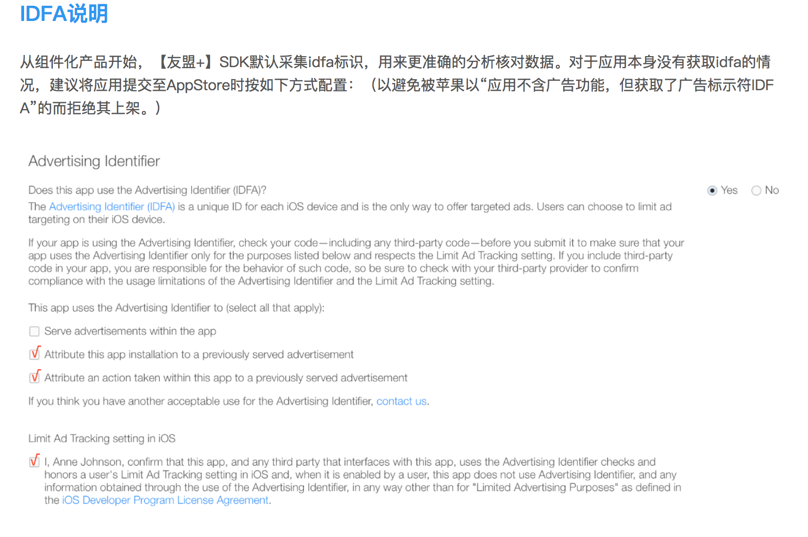

# bmWXShare

> 功能简介：基于友盟ShareSDK实现，微信分享（分享到朋友圈，微信好友）及微信授权登录；
> 在使用分享之前，还需要一些配置 <br>
1.首先请到友盟平台注册App获取AppKey; <br>
2.iOS平台请参考友盟的[教程](https://developer.umeng.com/docs/66632/detail/66825)配置SSO白名单、及 URL Scheme；<br>
3.Android AppId一定要填写对，并且微信后台需要填写app签名，详情请看微信官方教程；<br>
4.为了让大家更灵活的根据产品定制样式，插件化版本的 分享UI 需要用户自行处理。


## 集成方式
**iOS集成方式**

* 打开iOS目录`工程目录/platforms/ios/WeexEros`，编辑Podfile文件，添加`ErosPluginWXShare`组件的引用，添加代码如下，**注意**版本号改为最新的版本（请看Change log）

	```ruby
	def common
    	...忽略其他库的引用
    	# 在这里添加引用 ErosPluginWXShare
    	pod 'ErosPluginWXShare', :git => 'https://github.com/bmfe/eros-plugin-ios-wxshare.git', :tag => '版本号请看页面最下面change log'
	end
	target 'WeexEros' do
    	common
	end
	```

* 在终端中`cd`到此目录下执行 `pod update`，等待命令执行完毕，重新运行项目，如果没有报错则说明`ErosPluginWXShare`组件集成成功；

**Android集成方式**


* 进入Android目录`工程目录/platforms/android/WeexFrameworkWrapper/` 目录下 clone 对应的插件。

``` java
git clone https://github.com/bmfe/eros-plugin-android-wxshare.git "erospluginumeng"
```

> 具体版本为Tag,如果您需要使用指定版本的话可以切换到指定的Tag.


* 打开Android目录`工程目录/platforms/android/WeexFrameworkWrapper/`,编辑`settings.gradle`,添加引入。
在`settings.gradle` 中 添加如下代码。

``` java
//这里只需要在最后添加 , ':erospluginwxshare'
include ':app',':sdk',':nexus', ':wxframework', ':erospluginwxshare'  

// 分享
project(':erospluginwxshare').projectDir = new File(settingsDir,'/erospluginumeng/library-wxshare')

```

* 打开Android目录`工程目录/platforms/android/WeexFrameworkWrapper/app`,编辑app目录下`build.gradle` 文件 `dependencies` 下添对应 插件引用。

``` java
	dependencies {
		....
		//分享
    compile project(':erospluginwxshare')
	}
```

* 具体Android 插件详细集成方式 您还可以参考[Android 插件依赖](/zh-cn/android_plugin_integration)


* 具体Android 相关[微信Key和签名申请参考文档](/zh-cn/android_wx_apply)

## 使用

**引用Module**

```js
var bmWXShare = weex.requireModule('bmWXShare')
```

**API**

* 初始化友盟SDK `initUM('appkey')` 

	> 在使用之前，请先调用此方法初始化友盟SDK

	```js
	bmWXShare.initUM('友盟平台申请的appkey')
	```

* 初始化微信SDK `initWX(info)`

	> 在使用分享到微信平台功能，或者微信登录功能前，需要调用此方法来初始化微信平台；

	```js
	bmWXShare.initWX({
	  appKey: 'appkey', // 微信开发平台申请的appkey
	  appSecret: 'appSecret', // appKey对应的appSecret，
	  redirectURL: '回调页面' // 授权回调页面
	})
	```
	
* 判断是否安装微信app `isInstallWXApp()`  使用该方法必须先调用初始化方法

	> 在使用微信分享或授权登录之前应该判断是否安装了微信app，如果没有安装应该隐藏相关功能按钮

	```js
	// 同步方法
	var result = bmWXShare.isInstallWXApp()
	```

* 分享：`share(info,successCallback,failedCallback)`

	```js
	bmWXShare.share({
	  title:'', // 分享的标题
	  content:'', // 分享的文字内容
	  url: '', // 分享对应的URL地址，如h5、音乐链接、视频链接、小程序的链接
	  image: '', // 分享的图片url
	  path: '', // 分享小程序用到的页面路径
	  userName: '' // 小程序名称
	  shareType: 'Webpage', // 分享的类型
	  platform: 'WechatSession' // 分享平台 朋友圈/好友（注意：历史版本的字段名是platforms,现在是一个字符串而不是数组）
	},function(resData){ // 注意： 历史版本返回的是一个promise对象，现在的是callback回调 	
	  // 成功回调
	},function(resData){
	  // 失败回调
	})

	// 分享平台
	platform:[
	  WechatSession, // 微信好友
	  WechatTimeLine // 分享至朋友圈
	]

	// 分享类型
	shareType:[
	  Text, // 文字
	  Image, // 图片
	  TextImage, // 图文
	  Webpage, // 网页
	  Music, // 音乐
	  Video, // 视频
	  MiniProgram // 小程序
	]
	```

* 微信授权登录：`authLogin(callback)`

	```js
	bmWXShare.authLogin(function(resData){	
	  // 授权结果，成功的话会将所有的userInfo返回
	  // console.log(resData)
	});
	```
	
## 注意事项
**iOS 提交审核** 时需要正确设置 IDFA 选项，如下图


## Change Log
**Android 1.1.1** <br>
* 更新Umeng库

**iOS 1.0.5** <br> 
* 分享接口添加`userName`字段，分享小程序时需要传小程序的名字；

**iOS 1.0.4** <br> 
* 再次修复获取是否安装微信方法走内置包时无效的问题；

**iOS 1.0.3** <br> 
* 修复获取是否安装微信方法无效的问题；

**iOS 1.0.2** <br> 
* 修复shareType字段取值问题，导致只能分享网页；

**iOS 1.0.1** <br>
* 修复友盟SDK报错的问题；
